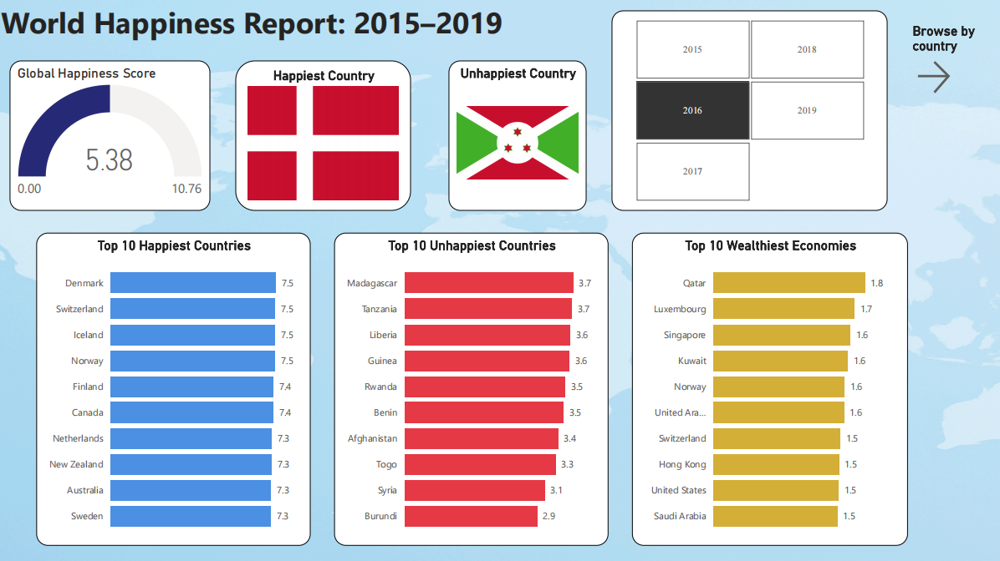
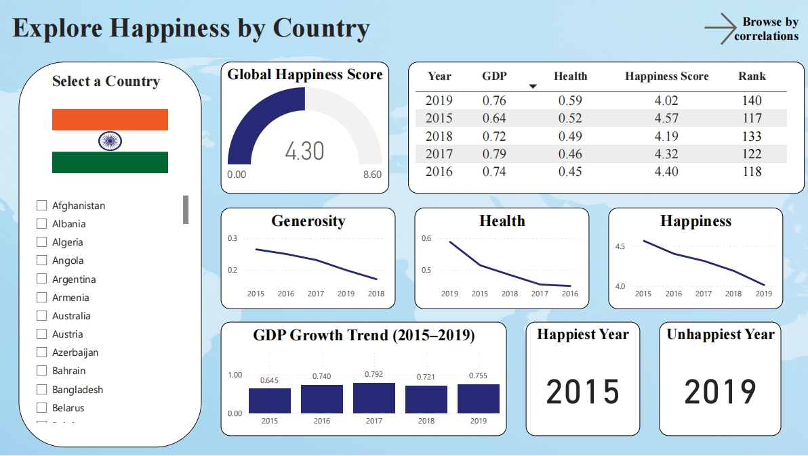

# 🌍 World Happiness Report Analysis & ML Modeling

Welcome to the **World Happiness Report Analysis & ML Modeling Project** – an end-to-end data science pipeline built to analyze and predict happiness scores worldwide from 2015 to 2019!

**Interactive Power BI Dashboard:** 👉 [Open PDF Export](visuals/Power_BI_Report.pdf)  
*(Contact for an interactive link! Explore global trends, country comparisons, and correlations.)*

<p align="center">
  
  
</p>


---

## 🚀 Project Overview

This project is designed to help you:

* **Analyze** global happiness scores across multiple years
* **Build and compare regression models** to predict country happiness scores
* **Interpret model results** with SHAP for explainable AI
* **Visualize findings** for both technical and non-technical audiences
* **Enhance storytelling** with custom country flag features in the dashboard

---

## 🗂️ Project Structure

Absolutely! Here’s your **project structure section** in markdown code block, following the convention you used:

```markdown
## 🗂️ Project Structure

world-happiness-report/
│
├── data/
│   ├── 2015.csv ... 2019.csv                         # Raw datasets
│   ├── world_happiness_final.csv                     # Cleaned, combined dataset
│   ├── world_happiness_predictions.csv               # Model predictions
│   ├── world_happiness_predictions_with_flags.csv    # Dataset with flag URLs
│
├── models/
│   ├── happiness_rf_model.pkl
│   ├── happiness_gbr_model.pkl
│   ├── happiness_xgb_model.pkl
│
├── notebooks/
│   ├── world_happiness_prediction.ipynb               # Main notebook
│   └── FlagURL_Generator.ipynb                        # Notebook for flag URLs
│
├── visuals/
│   ├── Power_BI_Report.pdf                            # Power BI dashboard export
│   └── screenshot.png                                 # Dashboard screenshot(s)
│
└── README.md
└── requirements.txt
```


---

## 📊 The Dataset

* **Source:** [World Happiness Report (2015–2019)](https://www.kaggle.com/datasets/unsdsn/world-happiness/)
* **Years:** 2015–2019, 150+ countries per year
* **Key Features:** GDP per Capita, Social Support, Health, Freedom, Generosity, Trust
* **Target:** Happiness Score (0–10 scale)
* **Special:** Country flag image URLs added for visualization in Power BI

---

## 🧠 Workflow & Modeling

### 1. Data Preparation

* Unified columns, handled missing values (e.g., imputation for Trust)
* Cleaned and merged datasets into `world_happiness_final.csv`

### 2. Exploratory Data Analysis

* Visualized happiness scores, feature distributions, and yearly trends
* Identified top/bottom countries, created heatmaps and boxplots

### 3. Feature Engineering

* Final feature set: **GDP, Social Support, Health, Freedom, Generosity, Trust**

### 4. Model Training & Evaluation

* **Models Used:**
  - Linear Regression
  - Random Forest Regressor
  - Gradient Boosting Regressor
  - XGBoost Regressor
* **Hyperparameter Tuning:** via `RandomizedSearchCV`
* **Metrics:** R² Score, RMSE

### 5. Model Explainability

* **SHAP:** Visualized global and local feature importances (bar, beeswarm, force plots)

### 6. Model Deployment

* Saved best models as `.pkl` in `/models`
* Final predictions stored in `/data/world_happiness_predictions.csv`

### 7. Enhanced Visualization

* Generated country flag URLs with `FlagURL_Generator.ipynb`
* Flags used in Power BI dashboard for clear, engaging visuals

---

## 📈 Power BI Dashboard

<p align="center">
  
</p>

**Features:**
- 🌍 Interactive world map of happiness scores
- 😃 Top 10 happiest & 😞 unhappiest countries
- 💰 Top 10 countries by GDP
- 📅 Year and variable filters (2015–2019)
- 📊 Correlation and trend visuals
- 🏳️ Country flags next to names (thanks to custom dataset!)
- 🧮 Advanced metrics and custom calculations using DAX

---

## 🤖 Results Summary

| Model             | R² Score | RMSE  |
|-------------------|----------|-------|
| Random Forest     | 0.795    | 0.500 |
| Gradient Boosting | 0.782    | 0.515 |
| XGBoost           | 0.788    | 0.507 |

- **Random Forest** performed best.  
- SHAP analysis: **GDP, Social Support, and Health** are the most important predictors.

---

---

## 🛠️ How to Run Locally

1. **Clone the Repository**

   ```bash
   git clone https://github.com/YOUR_GITHUB/world-happiness-report.git
   cd world-happiness-report
   ```

2. **Install Python Dependencies**

   ```bash
   pip install -r requirements.txt
   ```

3. **Run the Main Notebook**

   * Open `notebooks/world_happiness_prediction.ipynb`
   * Execute cells for EDA, modeling, and SHAP analysis

4. **Check the Power BI Dashboard**

   * View the dashboard online: Interactive Power BI Dashboard
   * Or see the PDF export: visuals/proj.pdf

---

## 🏳️ Bonus: Country Flag Enhancement

**Purpose:** Adds country flag images for use in dashboards

**How:**

* Uses `pycountry` to get ISO2 codes for each country
* Constructs flag URLs via [Flagpedia](https://flagpedia.net/data/flags/normal/in.png)
* Output: Merged into predictions file for use in Power BI

## 📌 Future Enhancements


- **Real-Time Data Integration:** Connect to live APIs (e.g., UN, World Bank) to automatically update happiness and economic indicators.
- **Geospatial Analysis:** Add advanced interactive maps (using Plotly or Folium) to explore regional patterns and trends in happiness.
- **Time-Series Forecasting:** Predict future happiness trends with ARIMA, Prophet, or LSTM, factoring in historical and macroeconomic data.
- **Explainable AI Enhancements:** Expand on SHAP with tools like LIME or Counterfactuals to provide deeper, more actionable insights for policymakers.
- **API for Model Serving:** Expose trained models as an API endpoint (using FastAPI or Flask) for integration with other systems and apps.
- **Custom User Scenarios:** Let users simulate changes in country-level features (GDP, health, social support) and see predicted changes in happiness scores in real time.

---

## Questions?

Open an issue or connect with me on [LinkedIn](https://www.linkedin.com/in/akshith-goud/)!

---